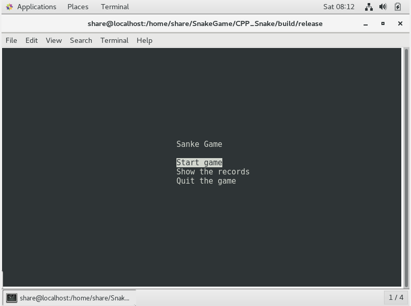

# SnakeGame
A Simple diy snake game implemented by pure C and C++

## 1 Brief intro
    This project is a simple implemented snake game which using pure C and C++ to write code. It's just for learning, I'm sure there will many bugs left.
## 2 How to compile and run it
    1)cd to build file
    2)execute the command: make for release version or make cmd=debug for debug version
    3)then you can find target file SnakeGame_Release in release directory or SnakeGame_debug in debug directory.
    4)cd to relase or debug directory then execute ./SnakeGame_Release or ./SnakeGame_debug, you can play SnakeGame, enjoy it!

## 3 Test in Linux (CentOS)
